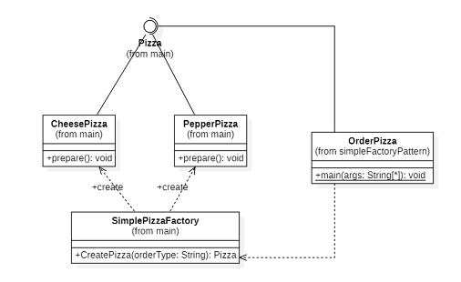
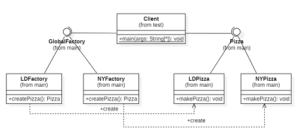
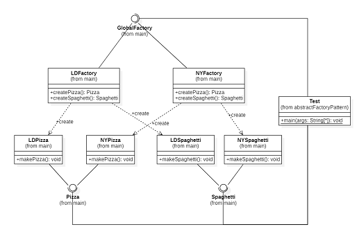
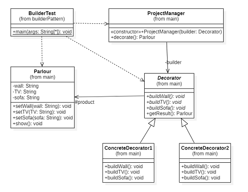
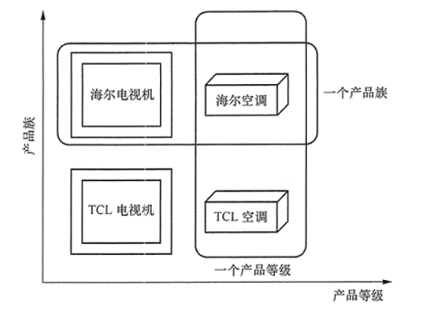

# BackupForDP

in case I lose the code for my DesignPatternsLab

tips:

> 工厂方法模式中的justTry包，可以不予理睬。它是我对于java读取xml数据的尝试，虽然它也能体现工厂模式。

## 01 引言

​        GoF 的 23 种设计模式又分为创建型模式、结构型模式、行为模式三种类型。其中，创建型模式提供创建对象的机制， 能够提升已有代码的灵活性和可复用性。它包括工厂方法模式、抽象工厂模式、单例模式、建造者模式、原型模式。单例模式保证一个类只有一个实例， 并提供一个访问该实例的全局节点。原型模式能够复制已有对象， 而又无需使代码依赖它们所属的类。可以这样说，单例模式和原型模式侧重点不在于创建本身，它们的主要过程是创建，但侧重点是“一个类一个实例”、“复制已有对象”。相反地，工厂方法模式、抽象工厂模式和创建者模式侧重点在于创建本身，但具体的实现不尽相同。本文旨在通过代码实现，深刻体会这三者异同点。

​        广义的工厂模式的定义：定义一个创建产品对象的工厂接口，将产品对象的实际创建工作推迟到具体子工厂类当中。它满足创建型模式中所要求的“创建与使用相分离”的特点。按实际业务场景划分，工厂模式有 3 种不同的实现方式，分别是简单工厂模式、工厂方法模式和抽象工厂模式。其中，简单工厂模式不属于GoF 的 23 种设计模式，但出于加深对工厂模式、抽象工厂模式的理解的考虑，本文加上该设计模式的论述。

​       本文先分别介绍四个设计模式，其中对于三种工厂模式的介绍是递进的，而后本文将重点阐述三种工厂模式之间的区别以及工厂模式和创建者模式的区别。实现代码详见我的github仓库：[lori0423/BackupForDP: in case I lose the code for my DesignPatternsLab (github.com)](https://github.com/lori0423/BackupForDP)。

## 02 几种模式对比

### 2.1 简单工厂模式

#### 2.1.1 模式结构与实现

简单工厂模式的主要角色如下：

- 简单工厂（`SimplePizzaFactory`）：是简单工厂模式的核心，负责实现创建所有实例的内部逻辑。工厂类的创建产品类的方法可以被外界直接调用，创建所需的产品对象。
- 抽象产品（`Pizza`）：是简单工厂创建的所有对象的父类，负责描述所有实例共有的公共接口。
- 具体产品（`CheesePizza`和`PepperPizza`）：是简单工厂模式的创建目标。

#### 2.1.2 模式总结

把被创建的对象称为“产品”，把创建产品的对象称为“工厂”。如果要创建的产品不多，只要一个工厂类就可以完成，这种模式叫“简单工厂模式”。它的优点是客户端可以免除直接创建产品对象的职责，很方便的创建出相应的产品。但随之而来的是它的缺点——使用简单工厂模式会增加系统中类的个数（引入新的工厂类），增加系统的复杂度和理解难度。另外，我们也看到简单工厂模式的工厂类单一，负责所有产品的创建，职责过重，一旦异常，整个系统将受影响。且工厂类代码会非常臃肿，违背高聚合原则。最后，它还有一个缺点便是系统扩展困难，一旦增加新产品不得不修改工厂逻辑，在产品类型较多时，可能造成逻辑过于复杂。这个缺点将由工厂方法模式解决。

### 2.2 工厂方法模式

#### 2.2.1 模式结构与实现

工厂方法模式的主要角色如下。

- 抽象工厂（`GlobalFactory`）：提供了创建产品的接口，调用者通过它访问具体工厂的工厂方法 `createPizza()` 来创建产品。
- 具体工厂（`LDFactory`和`NYFactory`）：主要是实现抽象工厂中的抽象方法，完成具体产品的创建。
- 抽象产品（`Pizza`）：定义了产品的规范，描述了产品的主要特性和功能。
- 具体产品（`LDPizza`和`NYPizza`）：实现了抽象产品角色所定义的接口，由具体工厂来创建，它同具体工厂之间一一对应。

#### 2.2.2 模式总结

相比简单工厂模式，工厂方法模式灵活性增强，对于新产品的创建，只需多写一个相应的工厂类。同时，它也是典型的解耦框架，高层模块只需要知道产品的抽象类，无须关心其他实现类，满足迪米特法则、依赖倒置原则和里氏替换原则。它的缺点仍然包括类的个数容易过多，增加复杂度。这种方法还有一个缺点——抽象工厂只能生产一种产品，如图中的`Pizza`。这个缺点将由抽象工厂模式解决。

### 2.3 抽象工厂模式

#### 2.3.1 模式结构与实现

抽象工厂模式的主要角色与工厂方法模式大致相同，稍有不同的是它的抽象工厂包含多个创建产品的方法 createProduct()，可以创建多个不同等级的产品。如图中的`createPizza()`和`createSpaghetti()`。抽象工厂模式中，具体产品同具体工厂之间是多对一的关系。

#### 2.3.2 模式总结

抽象工厂模式除了具有工厂方法模式的优点外，其他优点，如当需要产品族（同一个具体工厂所生产的位于不同等级的一组产品）时，抽象工厂可以保证客户端始终只使用同一个产品的产品族。抽象工厂增强了程序的可扩展性，当增加一个新的产品族时，不需要修改原代码，满足开闭原则。其缺点是：当产品族中需要增加一个新的产品时，所有的工厂类都需要进行修改。

### 2.4 建造者模式

#### 2.4.1 模式结构与实现

#### 2.4.2 模式总结

建造者模式的定义：指将一个复杂对象的构造与它的表示分离，使同样的构建过程可以创建不同的表示。它是将一个复杂的对象分解为多个简单的对象，然后一步一步构建而成。创建者模式同工厂模式有相同的特性：客户端不必知道产品内部组成的细节。它的优点是封装性好，构建和表示分离。它有一个缺点是如果产品内部发生变化，则建造者也要同步修改，后期维护成本较大。

## 03 总结

### 3.1 三种工厂模式的区别

产品族与产品等级概念图：

- 简单工厂 ： 用来生产同一等级结构中的任意产品。（不支持拓展增加产品）

- 工厂方法 ：用来生产同一等级结构中的固定产品。（支持拓展增加产品）   

- 抽象工厂 ：用来生产不同产品族的全部产品。（支持拓展增加产品；支持增加产品族）  

### 3.2 工厂模式和创建者模式的区别

建造者模式构建对象的时候，对象通常构建的过程中需要多个步骤，就像我们例子中的先有主机，再有显示屏，再有鼠标等等，建造者模式的作用就是将这些复杂的构建过程封装起来。工厂模式构建对象的时候通常就只有一个步骤，调用一个工厂方法就可以生成一个对象。建造者模式和工厂模式的关注点不同：建造者模式注重零部件的组装过程，而工厂方法模式更注重零部件的创建过程。两者可以结合使用。

